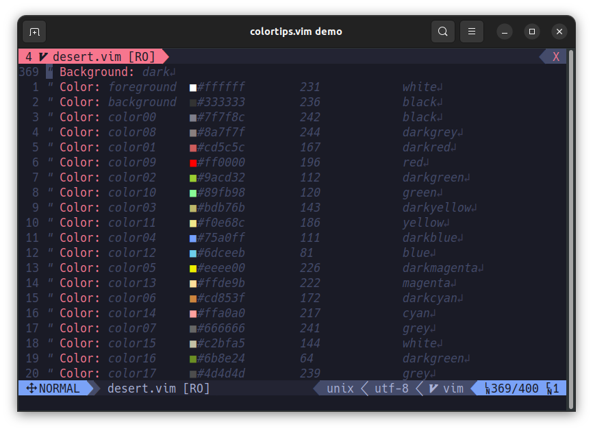
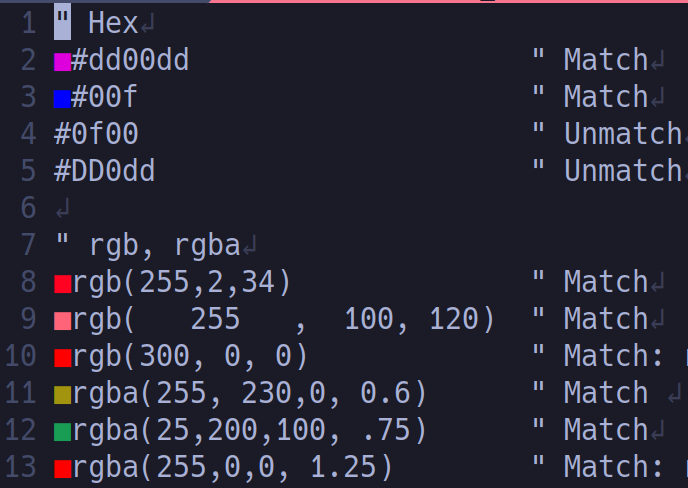
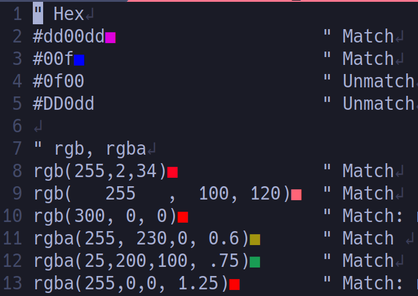
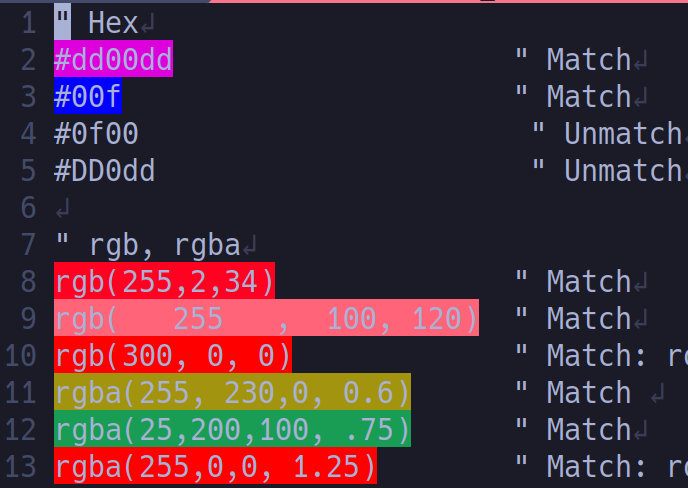
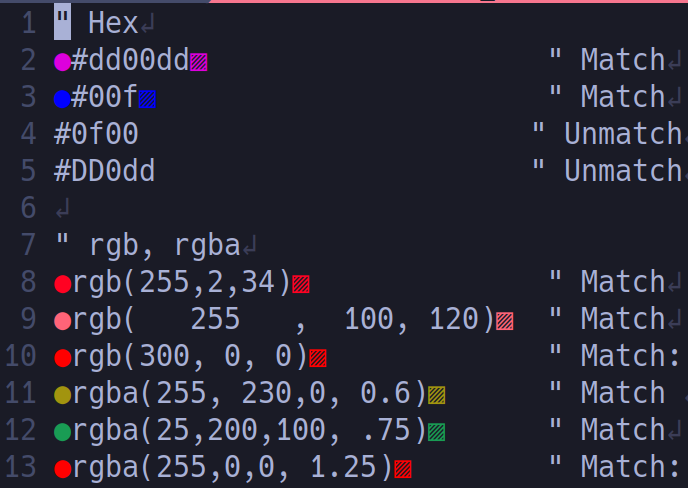

# colortips.vim
color tips for vim



## Requirements
This plugin require following two features.
* Vim9 or newer(need vim9script)
* Terminal-Emulator, Shell, Terminal-Multiplexer support **true-color**

## Installation
### dein.vim
Add folowing text to your `.vimrc`.

```vim
dein#add('takeshid/colortips.vim')
```
## Features
Display colorcode tips such as following representaions.
* Hex Triplet: `#dd00dd`, `#DD00dd`, `#000`
* RGB(A): `rgb(r,b,g)`, `rgba(r,g,b,a)`


## Enable
`colortips.vim` is enable on vim-startup.
```vim
let g:colortips_enable = 1 " default 1, if assigned 0, colortips.vim is disable on vim-startup
```

## Commands
Swtiching enable/disable.
```vim
:ColorTipsEnable
:ColorTipsDisable
:ColorTipsToggle
```

## Perfomance
soso

## Customization
### Tip Position Visible
#### left(Default)
```vim
let g:colortips_left_visible = 1
let g:colortips_right_visible = 0
let g:colortips_fill_visible = 0
```


#### right
```vim
let g:colortips_left_visible = 0
let g:colortips_right_visible = 1
let g:colortips_fill_visible = 0
```


#### fill
```vim
let g:colortips_left_visible = 0
let g:colortips_right_visible = 0
let g:colortips_fill_visible = 1
```



### Tips Character
### Default
```vim
let g:colortips_left_char = '■'
let g:colortips_right_char = '■'
```

### Example
```vim
let g:colortips_left_visible = 1
let g:colortips_right_visible = 1
let g:colortips_fill_visible = 0
let g:colortips_left_char = '▨'
let g:colortips_right_char = '●'
```

